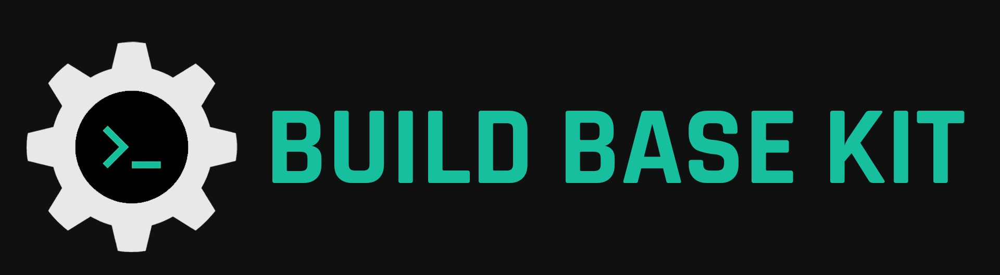

  

#  BuildBaseKit – Startup Boilerplates for Developers

We accelerate software development by providing **high-quality code boilerplates** for startups and developers.  
Our ready-to-use templates serve as a **tested foundation** that can be reused with minimal changes across different projects, eliminating tedious setup work.  

Currently, we focus on **Spring Boot boilerplates** (both free and premium), covering common needs like REST APIs, file storage, and authentication.  
Our mission is simple: *skip the repetitive stuff and launch projects faster.* ⚡

---

## 📦 Our Boilerplates
Each boilerplate template comes packed with essential features and best practices:

- Preconfigured **controllers, services, security, and configs**  
- Real-world project structure and proven patterns  
- Open-source starter kits (here on GitHub)  
- Advanced versions (on Gumroad) with documentation and walkthroughs  

👉 Future expansions will cover **Angular, Next.js, and more**, so you can build across multiple stacks.

---

## 💡 Why Choose BuildBaseKit?

- **⏱ Save Time** – eliminate repetitive setup tasks  
- **🛠 Quality & Consistency** – enforce proven coding standards and clean architecture  
- **🚀 Startup-Friendly** – authentication, integrations, and ready-to-scale foundations  
- **📚 Educational Resources** – tutorials and articles on [Dev.to](https://dev.to/buildbasekit) & [Blogs](https://buildbasekit.com/blogs)  
- **⚡ Flexible Options** – free GitHub templates or premium Gumroad boilerplates with extras  

---

## 🌐 Connect With Us

- **Website:** [buildbasekit.com](https://buildbasekit.com) 
- **Dev.to:** [buildbasekit](https://dev.to/buildbasekit)  
- **Gumroad:** [buildbasekit.gumroad.com](https://buildbasekit.gumroad.com/)  

---

### ⭐ Support the Project
If you find BuildBaseKit useful:  
- Star ⭐ this profile  
- Follow for updates 🔔  
- Try our free & premium boilerplates on [Gumroad](https://buildbasekit.gumroad.com/)

---

**BuildBaseKit** – your partner for **productivity, consistency, and speed** in startup development.  
